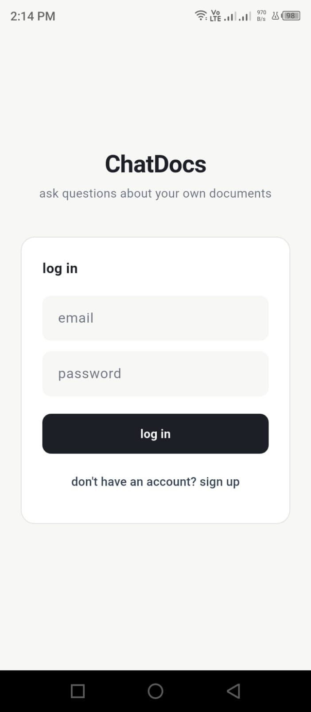
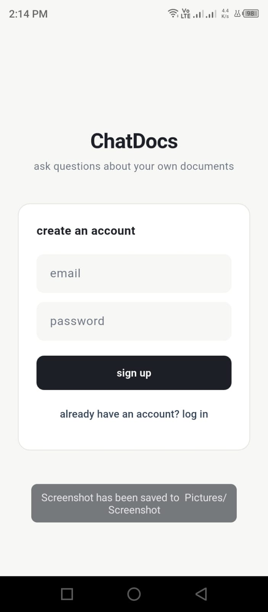
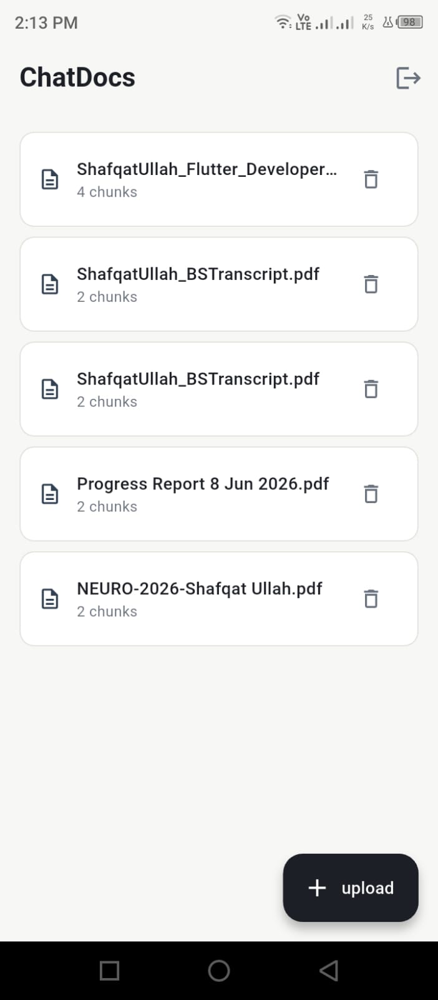
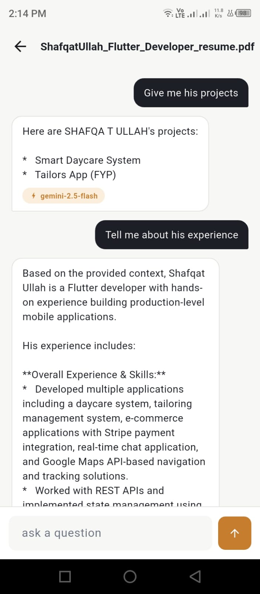

# ChatDocs

<div align="center">

### Chat with Your Documents Using AI

Upload **PDF**, **DOCX**, or **TXT** files and ask natural-language questions about their content. ChatDocs uses **Retrieval-Augmented Generation (RAG)**, **semantic search**, **Hugging Face embeddings**, **Supabase pgvector**, and a **multi-provider LLM fallback chain** to generate grounded, document-specific answers.

---


</div>

---

# Table of Contents

- Project Overview
- Key Features
- Demo
- Screenshots
- System Architecture
- Technology Stack
- Folder Structure
- How It Works
- Installation
- Environment Variables
- Backend
- Frontend
- AI Pipeline
- APIs
- Deployment
- Future Improvements

---

# Project Overview

ChatDocs is a full-stack AI-powered document question answering application that enables users to upload their own documents and interact with them using natural language.

Instead of manually reading long reports, contracts, research papers, resumes, or notes, users can simply ask questions and receive answers that are generated only from the uploaded document.

Unlike a normal chatbot, ChatDocs does **not** rely on general knowledge.

Instead, it performs:

- Semantic Search
- Retrieval-Augmented Generation (RAG)
- Context Grounding
- Vector Similarity Search

to ensure responses come directly from the uploaded document.

Each user has completely isolated storage, meaning documents and conversations are private.

---

# Key Features

## Authentication

- Email & Password Authentication
- Supabase Authentication
- JWT Access Tokens
- Secure Session Management
- User Isolation

---

## Document Upload

Supports:

- PDF
- DOCX
- TXT

Features:

- Upload from Flutter
- Automatic parsing
- Temporary file storage
- Background processing
- Upload status polling
- Error handling

---

## Intelligent Document Processing

Every uploaded document goes through an AI pipeline:

```
Document
      │
      ▼
Document Loader
      │
      ▼
Semantic Chunking
      │
      ▼
Embedding Generation
      │
      ▼
Vector Storage
      │
      ▼
Ready for Search
```

---

## Semantic Chunking

Instead of splitting text every fixed number of characters,

ChatDocs uses **LangChain SemanticChunker** to detect meaningful topic boundaries.

Benefits:

- Better retrieval
- Better context
- Higher answer quality
- Less hallucination

---

## Semantic Search

Questions are converted into embeddings.

The system retrieves only the most relevant chunks using cosine similarity.

No keyword matching.

Pure semantic understanding.

---

## AI-Powered Chat

Users can:

- Ask unlimited questions
- Receive grounded answers
- View answer sources
- Continue previous conversations

Every chat belongs to exactly one document.

---

## Persistent Chat History

Every conversation is permanently stored.

Users can reopen any uploaded document and continue chatting where they left off.

---

## Document Management

- View uploaded documents
- Delete documents
- View chunk count
- Refresh document list

---

## Background Processing

Large PDFs are processed asynchronously.

Instead of waiting several minutes,

the backend immediately responds with:

```

Processing...

```

Flutter automatically polls the backend until processing completes.

---

## Automatic LLM Fallback

If one provider becomes unavailable,

ChatDocs automatically switches to another provider.

Current priority:

1. Gemini 2.5 Flash
2. Groq Qwen3-32B
3. Groq Llama 3.3 70B
4. Mistral Large

Users never need to retry manually.

---

## Secure Multi-Tenant Architecture

Every document contains metadata:

- user_id
- doc_id
- filename

Every search filters using:

```
user_id
AND
doc_id
```

This guarantees:

- Users cannot access each other's files.
- Chats remain isolated.
- Search results are private.

---

# Screenshots

> Add screenshots here.

Example:

```
assets/screenshots/

icon.jpeg

login.jpeg

signup.jpeg

documents.jpeg

chat.jpeg

```

| Icon | Login | SignUp |
|--------|-----------|-----------|
|  |  |  |

| Documents | Chat |
|--------|------|
|  | |

---

# System Architecture

```text
                    Flutter Mobile App
                            │
                            │
                            ▼
                Supabase Authentication
                            │
                            ▼
                 FastAPI Backend (Railway)
                            │
        ┌───────────────────┼───────────────────┐
        │                   │                   │
        ▼                   ▼                   ▼
Document Loader      HuggingFace         Chat History
                     Embeddings           (Supabase)
        │
        ▼
 Semantic Chunker
        │
        ▼
Supabase pgvector
        │
        ▼
Similarity Search
        │
        ▼
Context Retrieval
        │
        ▼
LLM Fallback Chain
        │
        ▼
Generated Answer
```

---

#  Technology Stack

## Frontend

- Flutter
- Dart
- Provider
- HTTP
- File Picker
- UUID
- Supabase Flutter SDK

---

## Backend

- Python
- FastAPI
- Uvicorn

---

## AI

- LangChain
- Hugging Face Embeddings
- SemanticChunker
- RAG
- LCEL

---

## LLMs

- Gemini 2.5 Flash
- Groq Qwen3-32B
- Groq Llama 3.3 70B
- Mistral Large

---

## Database

- Supabase
- PostgreSQL
- pgvector

---

## Deployment

- Railway

---

#  Project Structure

```
ChatDocs
│
├── backend
│   ├── app.py
│   ├── rag_model.py
│   ├── requirements.txt
│   └── .env
│
├── chatdocsflutter
│   ├── lib
│   ├── assets
│   ├── android
│   └── pubspec.yaml
│
└── README.md
```

---

# Installation

## Clone Repository

```bash
git clone https://github.com/yourusername/ChatDocs.git

cd ChatDocs
```

---

## Backend Setup

```bash
python -m venv .venv
```

Windows

```bash
.venv\Scripts\activate
```

Linux / macOS

```bash
source .venv/bin/activate
```

Install dependencies

```bash
pip install -r requirements.txt
```

---

## Frontend Setup

```bash
cd chatdocsflutter

flutter pub get

flutter run
```

---

## Environment Variables

Create a `.env`

```env
SUPABASE_URL=

SUPABASE_SECRET_KEY=

GOOGLE_API_KEY=

GEMINI_API_KEY=

GROQ_API_KEY=

MISTRAL_API_KEY=
```

---

#  Backend Architecture

ChatDocs follows a clean architecture where the Flutter application is responsible only for the user interface and authentication, while every AI-related operation is performed by the FastAPI backend.

The mobile application never communicates directly with the database for document storage or retrieval.

Instead, every request flows through the backend, allowing authentication, validation, retrieval, AI inference, and database operations to be performed securely.

```
Flutter App
      │
      ▼
FastAPI
      │
      ├────────────── Authentication
      │
      ├────────────── Document Processing
      │
      ├────────────── Embedding Generation
      │
      ├────────────── Vector Search
      │
      ├────────────── LLM Inference
      │
      └────────────── Chat History
```

---

#  Complete AI Pipeline

Every uploaded document passes through the following pipeline.

```
User Uploads Document
            │
            ▼
File Validation
            │
            ▼
Document Loader
            │
            ▼
Metadata Injection
            │
            ▼
Semantic Chunking
            │
            ▼
Embedding Generation
            │
            ▼
Supabase Vector Store
            │
────────────────────────────────────────────
            │
User asks Question
            │
            ▼
Question Embedding
            │
            ▼
Vector Similarity Search
            │
            ▼
Top Relevant Chunks
            │
            ▼
Prompt Construction
            │
            ▼
LLM Fallback Chain
            │
            ▼
Answer Generation
            │
            ▼
Store Chat History
            │
            ▼
Return Answer
```

---

#  Document Processing

The backend currently supports:

- PDF
- DOCX
- TXT

Each document type is automatically routed to the correct LangChain loader.

| File Type | Loader |
|-----------|--------|
| PDF | PyPDFLoader |
| DOCX | Docx2txtLoader |
| TXT | TextLoader |

After loading, every document receives metadata.

Example:

```json
{
  "user_id": "...",
  "doc_id": "...",
  "filename": "resume.pdf"
}
```

This metadata is stored alongside every chunk inside Supabase.

---

# Semantic Chunking

Instead of splitting text every fixed number of characters,

ChatDocs uses

**LangChain SemanticChunker**

which finds semantic boundaries by comparing sentence embeddings.

Advantages:

- Better retrieval quality
- Better context preservation
- Lower hallucination
- Better answer accuracy

Traditional chunking

```
Paragraph
────────────
Split
────────────
Sentence Broken
```

Semantic Chunking

```
Topic A
────────────

Topic B
────────────

Topic C
```

The resulting chunks represent complete ideas instead of arbitrary character ranges.

---

#  Embedding Generation

Every chunk is converted into a dense vector representation.

Current embedding model:

```
BAAI/bge-small-en-v1.5
```

### Why this model?

Originally the project used

```
BAAI/bge-m3
```

but the model required significantly more memory and exceeded free-tier hosting limits.

Later the project experimented with

```
gemini-embedding-001
```

which solved the memory issue but introduced API quota and rate-limit problems.

Finally the project adopted

```
BAAI/bge-small-en-v1.5
```

because it provides:

- Small memory footprint
- Fast inference
- Unlimited local embeddings
- No API cost
- Good semantic retrieval quality

---

#  Embedding Singleton

The embedding model is loaded only once.

```
Server Starts
      │
      ▼
Load Embedding Model
      │
      ▼
Reuse Same Model
      │
      ▼
Every Request
```

Benefits:

- Lower memory usage

- Faster requests

- Prevents repeated downloads

- Avoids unnecessary model initialization

---

#  Vector Database

Instead of storing embeddings in memory,

ChatDocs stores them permanently in

**Supabase PostgreSQL + pgvector**

Each row contains

- Text Chunk
- Embedding
- Metadata

```
Chunk
Embedding
Metadata
```

Metadata includes

```
user_id

doc_id

filename
```

---

#  Similarity Search

When a user asks a question,

the question is embedded using the same embedding model.

Then pgvector performs cosine similarity search.

```
Question
      │
      ▼
Embedding
      │
      ▼
Cosine Similarity
      │
      ▼
Top 4 Chunks
```

Only chunks belonging to

- current user

AND

- current document

are searched.

---

#  Multi-Tenant Security

Every query contains two filters.

```
user_id

doc_id
```

This guarantees

```
User A
    │
    ├── Resume
    ├── Notes
    └── Contract

User B
    │
    ├── Research
    ├── CV
    └── Book
```

Even if two users upload documents with the same filename,

their vectors remain completely isolated.

---

#  Retrieval-Augmented Generation (RAG)

After retrieval,

the selected chunks become context.

```
Question

+

Retrieved Context

↓

Prompt

↓

LLM

↓

Answer
```

The language model never receives the entire database.

Only the most relevant chunks are sent.

This significantly reduces hallucinations while improving factual accuracy.

---

#  LangChain Components

ChatDocs uses several LangChain modules.

### Document Loaders

- PyPDFLoader
- Docx2txtLoader
- TextLoader

---

### Text Splitter

- SemanticChunker

---

### Embeddings

- HuggingFaceEmbeddings

---

### Vector Store

- SupabaseVectorStore

---

### Retriever

```
vector_store.as_retriever()
```

---

### Prompt

```
ChatPromptTemplate
```

---

### LCEL Components

- RunnablePassthrough
- RunnableLambda

Instead of deprecated chains,

the project uses the latest

LangChain Expression Language (LCEL).

---

#  LLM Fallback Chain

One of the project's strongest features is automatic provider fallback.

```
Gemini
     │
Fail?
     │
     ▼
Groq Qwen
     │
Fail?
     │
     ▼
Groq Llama
     │
Fail?
     │
     ▼
Mistral
```

Users do not need to retry requests manually.

The backend automatically switches providers when

- Rate limits occur
- Quota is exhausted
- Temporary API failures happen

---

#  Chat History

Every conversation is stored permanently.

Tables

```
chat_threads

chat_messages
```

Each message contains

- Role
- Content
- Provider
- Sources
- Timestamp

This allows users to continue conversations later.

---

#  REST API

## Authentication

All endpoints require

```
Authorization

Bearer <access_token>
```

The backend verifies every token using Supabase Authentication.

---

## Upload Document

```
POST /upload
```

Uploads

- PDF
- DOCX
- TXT

Returns

```json
{
    "status":"processing",
    "doc_id":"..."
}
```

---

## Upload Status

```
GET /upload/{doc_id}/status
```

Possible states

```
processing

done

error
```

---

## Chat

```
POST /chat
```

Request

```json
{
    "doc_id":"...",
    "question":"..."
}
```

Response

```json
{
    "answer":"...",
    "provider":"Gemini",
    "sources":[]
}
```

---

## Chat History

```
GET /chat/{doc_id}/history
```

Returns every message associated with one document.

---

## Documents

```
GET /documents
```

Returns

- filename
- chunk count
- doc_id

---

## Delete Document

```
DELETE /document/{doc_id}
```

Deletes

- vectors
- metadata
- chat association

for that document.

---

#  Authentication Flow

```
Flutter

↓

Supabase Login

↓

JWT Token

↓

FastAPI

↓

Supabase Verification

↓

Authorized Request
```

The backend never trusts a client-provided `user_id`.

Instead,

it derives the authenticated user directly from the verified JWT.

This prevents unauthorized access to another user's documents.

---

#  Background Processing

Large documents are processed asynchronously.

```
Upload

↓

Background Task

↓

Processing

↓

Embedding

↓

Done
```

Flutter periodically polls

```
GET /upload/{doc_id}/status
```

until processing completes.

This avoids request timeouts for large files while providing a smoother user experience.

---

#  Deployment

The backend is deployed on **Railway**, while the frontend is a Flutter mobile application.

This architecture separates the UI from the AI backend, allowing independent updates and deployment.

```
Flutter App
      │
      ▼
Railway (FastAPI)
      │
      ▼
Supabase
      │
      ▼
pgvector
      │
      ▼
LLM Providers
```

---

#  Deployment Architecture

```text
                    Android Application
                           │
                           │ HTTPS
                           ▼
                  Railway (FastAPI API)
                           │
        ┌──────────────────┼──────────────────┐
        │                  │                  │
        ▼                  ▼                  ▼
   Supabase Auth      Supabase DB      Hugging Face
                                          Embeddings
        │
        ▼
    PostgreSQL
      + pgvector
        │
        ▼
 Retrieval Pipeline
        │
        ▼
Gemini / Groq / Mistral
```

---

# Environment Variables

The backend requires the following environment variables.

```env
SUPABASE_URL=

SUPABASE_SECRET_KEY=

GOOGLE_API_KEY=

GEMINI_API_KEY=

GROQ_API_KEY=

MISTRAL_API_KEY=
```

> Never commit `.env` files to GitHub.

---

#  Running the Backend

Install dependencies

```bash
pip install -r requirements.txt
```

Run FastAPI

```bash
uvicorn app:app --reload
```

Production

```bash
uvicorn app:app --host 0.0.0.0 --port $PORT
```

---

#  Running Flutter

```bash
flutter pub get

flutter run
```

Build release APK

```bash
flutter build apk --release
```

Split APK by architecture

```bash
flutter build apk --release --split-per-abi
```

---

#  Backend Folder Structure

```text
backend/

├── app.py
├── rag_model.py
├── requirements.txt
├── .env
```

### app.py

Responsible for:

- FastAPI application
- API endpoints
- Authentication
- Request validation
- Background tasks

---

### rag_model.py

Contains:

- Document loading
- Chunking
- Embeddings
- Vector database
- Retrieval
- LangChain pipeline
- LLM fallback chain
- Chat history
- Document management

---

# Flutter Folder Structure

```text
lib/

├── Api_Handling/
│      api_service.dart
│
├── Chat/
│      chat_provider.dart
│      chat_screen.dart
│
├── Documents/
│      documents_screen.dart
│
├── provider/
│      provider.dart
│
├── user_authentication/
│      user_auth.dart
│      login_signup_screen.dart
│
├── widgets/
│
└── main.dart
```

---

#  Application Flow

```text
User Opens App
        │
        ▼
Login / Signup
        │
        ▼
Documents Screen
        │
        ▼
Upload File
        │
        ▼
Background Processing
        │
        ▼
Ready
        │
        ▼
Open Chat
        │
        ▼
Ask Question
        │
        ▼
AI Response
        │
        ▼
History Saved
```

---
#  Performance Optimizations

Several optimizations were implemented during development.

## Singleton Embedding Model

The Hugging Face embedding model is loaded only once.

Benefits

- Faster inference
- Lower RAM usage
- No repeated downloads

---

## Background Processing

Large PDF processing occurs in background tasks.

Benefits

- No request timeout
- Better user experience

---

## Thread Pool Execution

CPU-intensive tasks execute in a worker thread.

Benefits

- Keeps FastAPI responsive
- Allows concurrent API requests

---

## Automatic Provider Switching

If an AI provider becomes unavailable,

the application automatically switches to another provider.

Benefits

- Better reliability
- Higher uptime
- Reduced failed requests

---

#  Challenges Faced

This project involved solving several real-world engineering problems.

### Memory Constraints

Originally the project used

- BAAI/bge-m3

The model exceeded the available memory on free hosting platforms.

The solution was migrating to

- BAAI/bge-small-en-v1.5

which significantly reduced memory usage while maintaining strong retrieval quality.

---

### API Rate Limits

Using hosted embedding APIs introduced quota limitations.

The final solution was switching to local Hugging Face embeddings.

---

### Long Processing Times

Large documents caused request timeouts.

The backend was redesigned using FastAPI BackgroundTasks with upload status polling.

---

### Secure Multi-Tenant Retrieval

Initially, user identifiers were accepted from the client.

This posed a security risk.

The backend now derives the authenticated user directly from the verified Supabase JWT.

---

### Provider Reliability

Using only one LLM provider meant any outage would stop the application.

A fallback chain was implemented across multiple providers.


#  Technologies Used

## Frontend

- Flutter
- Dart
- Provider
- HTTP
- File Picker
- UUID
- Supabase Flutter SDK

---

## Backend

- Python
- FastAPI
- Uvicorn
- Pydantic

---

## AI & Machine Learning

- LangChain
- LangChain LCEL
- Hugging Face
- Sentence Transformers
- SemanticChunker
- Retrieval-Augmented Generation (RAG)

---

## Embedding Model

- BAAI/bge-small-en-v1.5

---

## LLM Providers

- Google Gemini 2.5 Flash
- Groq Qwen3-32B
- Groq Llama 3.3 70B
- Mistral Large

---

## Database

- Supabase
- PostgreSQL
- pgvector

---

## Deployment

- Railway

---

#  Contributing

Contributions are welcome!

If you'd like to improve ChatDocs:

1. Fork the repository.
2. Create a feature branch.

```bash
git checkout -b feature/new-feature
```

3. Commit your changes.

```bash
git commit -m "Add new feature"
```

4. Push the branch.

```bash
git push origin feature/new-feature
```

5. Open a Pull Request.

---

#  License

This project is released under the **MIT License**.

Feel free to use, modify, and distribute it in accordance with the license terms.

---

#  Author

**Shafqat Ullah**

AI/ML Engineer • Flutter Developer

If you found this project useful, consider giving it a on GitHub.

---

#  If You Like This Project

If ChatDocs helped you or inspired your own AI project,

please consider giving this repository a **Star** .

It helps others discover the project and supports future development.

---

<div align="center">

###  Built with Flutter, FastAPI, LangChain, Hugging Face, Supabase, Railway, and ❤️

**Thank you for visiting this repository!**

</div>